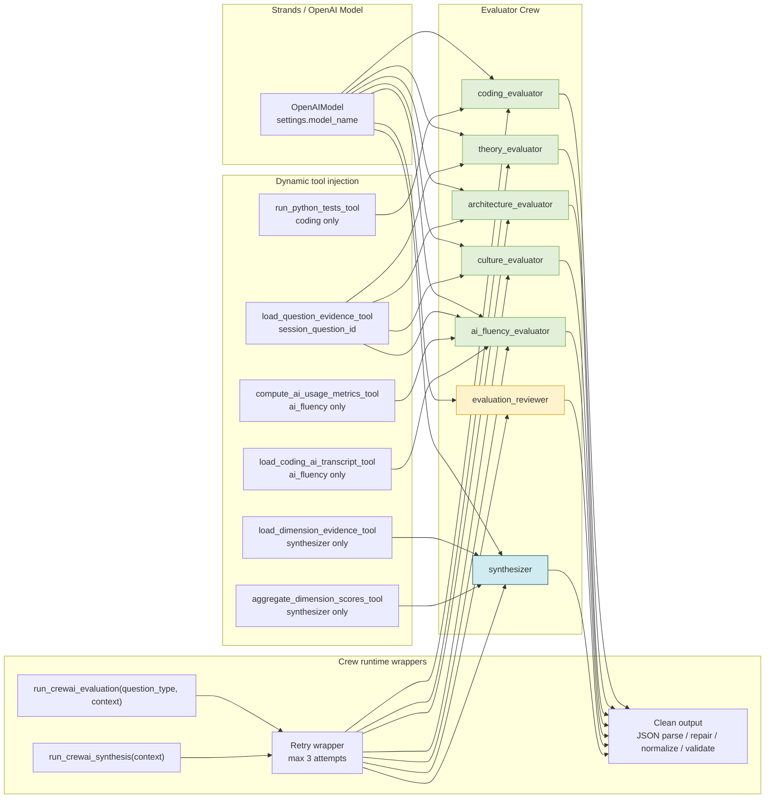

# Agent Graph

This diagram reflects the current crew implementation in `app/crew/agents.py` and `app/crew/crew.py`.

What this shows:

- The crew is made of five evaluator agents, one reviewer agent, and one synthesizer.
- Each agent is built with the same OpenAI-backed Strands model when LLMs are enabled.
- Tools are injected per context, not globally.
- Each invocation is a single-node `GraphBuilder` execution today, not a multi-step in-process agent mesh.
- The reviewer is a second-pass gate on evaluator output, not a separate human step in the current code.
- Outputs are cleaned, JSON-repaired, normalized, and validated before they are accepted.
