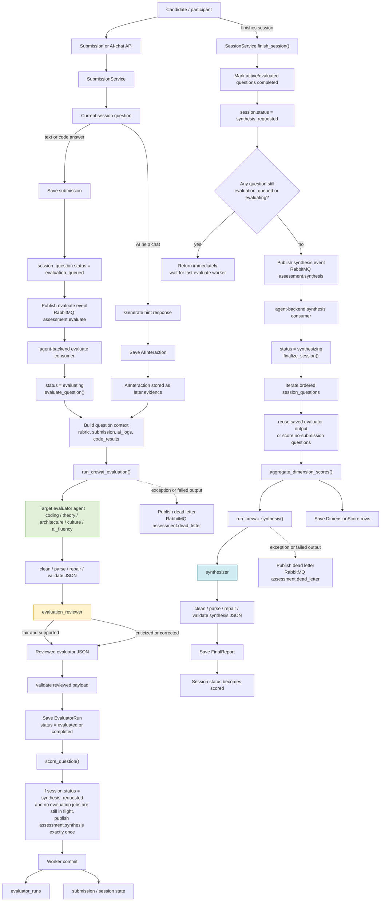

# Conversation Flow

This diagram shows how a submission moves through the current system, including the reviewer pass, retry/validation behavior, and the session-finalization path.

Current behavior in plain terms:

- A submission is saved first.
- Only text and code submissions publish evaluation work to RabbitMQ immediately.
- AI helper chat is persisted as evidence and may influence later evaluation, but it does not itself trigger evaluation.
- The agent backend moves question status through `evaluation_queued -> evaluating -> evaluated` while processing.
- The evaluator agent produces a JSON rubric response.
- The reviewer agent checks that response for fairness, evidence alignment, and rubric consistency.
- The validated output is persisted as an `EvaluatorRun`.
- Finishing a session now sets `synthesis_requested`. The last successful evaluation worker releases synthesis when no evaluation jobs are still in flight.
- The actual evaluator and synthesizer work now runs in the separate `agent-backend` service, not in the candidate-facing backend.
- Failures in evaluation or synthesis publish a dead-letter envelope to `assessment.dead_letter`.
- Session completion fans out across all questions, then the synthesizer produces the final recommendation.
