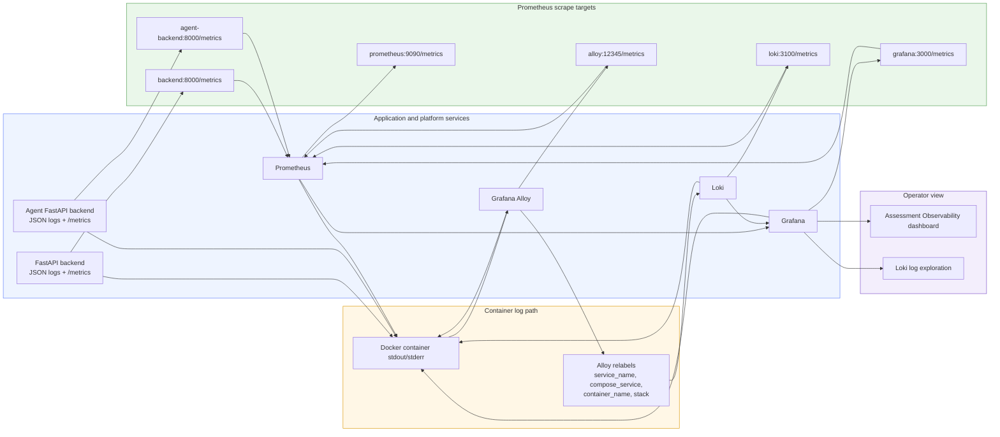

# Current Observability Architecture

This diagram shows the observability wiring that is actually implemented today.

What is implemented today:

- The candidate backend and the agent backend both expose Prometheus metrics on `/metrics`.
- Prometheus scrapes both backends, Prometheus itself, Loki, Alloy, and Grafana.
- Both backends write structured JSON logs to stdout.
- Alloy reads Docker container logs, adds labels, and forwards them to Loki.
- Grafana is provisioned with `Prometheus` and `Loki` datasources on startup.
- The starter dashboard is `Assessment Observability`.

Important current details:

- There is no Tempo or tracing pipeline in the current build.
- Strands logs flow through the agent-backend logger and reach Loki as agent-backend container logs.
- The current Strands dashboard panels are based on:
  - `assessment_strands_tokens_total`
  - `assessment_strands_duration_seconds`
