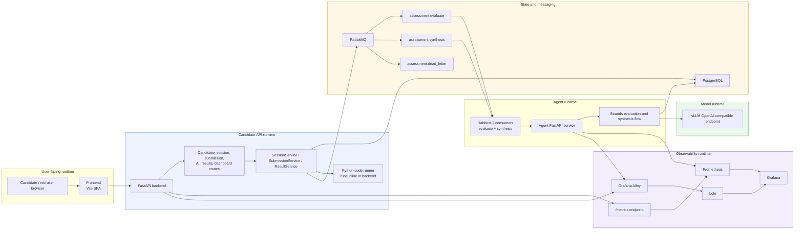

# Current Runtime Architecture

This diagram shows what is actually deployed today in `docker-compose.yml` and how the current runtime behaves.

What is true in the current runtime:

- The frontend talks directly to the FastAPI backend.
- The backend handles candidate/session HTTP requests and publishes RabbitMQ jobs.
- A separate `agent-backend` service consumes evaluation and synthesis jobs from RabbitMQ.
- Python code execution still happens inline in the backend process.
- RabbitMQ carries evaluation, synthesis, and dead-letter traffic between the API backend and the agent backend.
- Strands agents call the local `vllm` service through the OpenAI-compatible API.
- Prometheus scrapes both backends plus the observability services, Alloy ships container logs to Loki, and Grafana reads from Prometheus and Loki.
