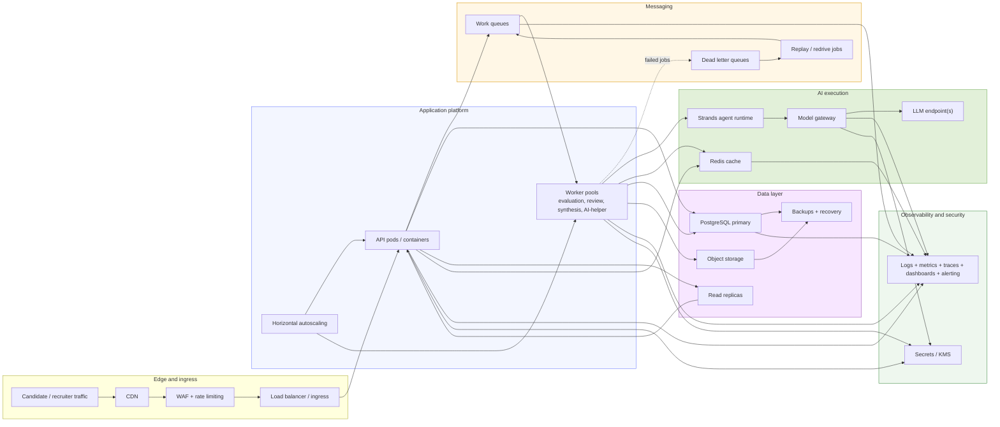

# Production Deployment Architecture

This diagram focuses on how the system should be deployed for real-world traffic, resilience, scaling, and operational visibility.

What this deployment view is making explicit:

- API and worker compute scale independently.
- Queues isolate burst traffic from slow downstream processing.
- DLQs and replay jobs are part of the default failure path.
- Redis sits near the agent runtime for hot reusable data and coordination.
- Read-heavy result and audit traffic should lean on replicas, not the primary database.
- Observability, backups, and secrets management are core platform pieces.

Production checks worth keeping in mind:

- Separate queues by workload type so synthesis cannot starve evaluation.
- Make submission, evaluation, and finalization flows idempotent.
- Put alarms on queue age, DLQ depth, worker failure rate, model error rate, DB saturation, and cache health.
- Keep final scores and session recommendations out of cross-candidate cache reuse.
