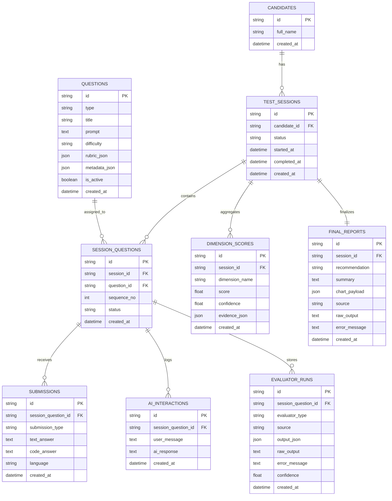

# Relational Data Model

This ER diagram is based on the SQLAlchemy models and Alembic migrations in `app/models` and `app/migrations`.

Key constraints and behavior:

- `session_questions` enforces one ordered row per `(session_id, sequence_no)`.
- `final_reports.session_id` is unique, so there is only one final report per session.
- `submissions`, `ai_interactions`, and `evaluator_runs` are append-only history tables for each session question.
- `dimension_scores` is rebuilt from the final session scoring pass.

