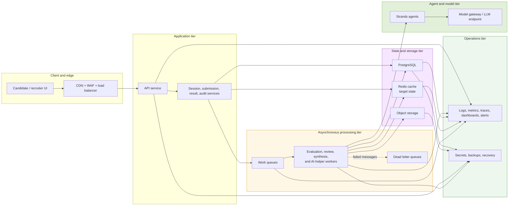

# Scalable Architecture Overview

This diagram is the high-level target architecture. It is not the current Docker Compose deployment. It shows the intended major runtime layers once the system is split into real async workers and supporting platform services.

Conceptually, the system should work like this:

- The API tier stays thin. It accepts traffic, writes core state, and publishes async work.
- The worker tier does the expensive parts: evaluation, review, synthesis, and AI-helper processing.
- Queues absorb spikes in traffic, and dead letter queues catch messages that repeatedly fail.
- Redis is shown here as a target-state cache for hot reusable data such as question/rubric lookups, prompt fragments, idempotency keys, and short-lived worker coordination. It is not part of the current Compose stack.
- Postgres remains the system of record, while object storage keeps larger raw agent payloads and audit artifacts.
- Observability and recovery are first-class parts of the system, not add-ons.

This view is intentionally abstract. The production deployment specifics live in [production-deployment-architecture.md](./production-deployment-architecture.md).

The key ideas are:

- Keep the API tier thin and push expensive work to workers.
- Use queues to smooth burst traffic and decouple processing stages.
- Use Redis for reusable hot data and short-lived coordination.
- Keep Postgres as the system of record and object storage for larger raw artifacts.
- Treat observability and recovery as part of the architecture, not as optional extras.
